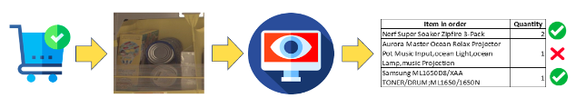

# binsense
This project includes necessary work to address the capstone Project 4 done part of IK ML Switch up program. The project is inspired from the [Amazon bin challenge](https://github.com/silverbottlep/abid_challenge)

## Project-4: BinSense AI - Inventory Vision System
Objectives: \
Use the dataset (images + metadata) and develop a highly accurate and fast computer vision model to verify if the items with their respective quantities are present in the image of the bin. 

For example, You get an order for 3 items and their quantities as mentioned below.You get an image of the bin where items in the order are present. Your objective is to validate whether the items in the order are the ones in the bin.



Dataset : [drive](https://docs.google.com/spreadsheets/d/1rZfFrHEbfX_b-3ofEIDxLQUFNDWtmDarXBrU4nn4Luw/edit#gid=601918728), [amazon dataset](https://github.com/awslabs/open-data-docs/tree/main/docs/aft-vbi-pds)

## Project contributors
| Name[^1]            | email                  |
|---------------------|------------------------|
| Leo Pimentel        | leo@groundswellai.com  |
| Nitesh Chinthireddy | reddy.nitesh@gmail.com |
| Rathi anand         | rathianandk@gmail.com  |
[^1]: *alphabetically ordered*

## Tools
- [Miniconda](https://conda.io/projects/conda/en/latest/user-guide/install/index.html)
- Podman or Docker
- VScode (code editor)
- Juypter
- git
- git-lfs
- aws-cli

## Languages
- Python
- Shell
- Javascript
- HTML
- CSS

## Project structure
|-binsense (root dir) \
|-|--scripts    : scripts to setup env, etc. \
|-|--docs       : detailed documents about objective, data analysis, data prep, model arch etc. \
|-|--libs       : shared code used in apps & notebooks \
|-|--notebooks  : try out juyptner notebooks \
|-|--apps       : deployable apps, docker files and necessary scripts

## Project setup
Sets up conda environment with python 3.11 & dependencies listed in train-environment.yml (using conda), *requirements.txt (using pip).

For API, we will define docker file to setup the environment.
```
./scripts/setup-env.sh --help
./scripts/setup-env.sh
conda activate binsense_condaenv
```

## AWS EC2 setup

### Set ENV variables
Add below lines to your source (~.zshrc for zsh, ~/.bashrc for bash) file
```
export IK_USER_AWS_PROFILE=ik_user
export IK_USER_AWS_ACCESS_KEY=<get-key-from-aws>
export IK_USER_AWS_ACCESS_SECRET=<get-secret-from-aws>
```

### Build Docker Image
```
docker build -t "binsense_ec2setup:0.0.1" ./scripts
```

### Run Docker Instance
After you run below commands, it should open up bash shell
```
DOCKER_IMG_ID=$(docker images | grep "binsense_ec2setup" | xargs echo $1 | cut -d ' ' -f 3)

[ ! -z "$DOCKER_IMG_ID" ] && docker run -v ./scripts/_mount:/aws/mount -it  $DOCKER_IMG_ID \
"AWS_PROFILE=$IK_USER_AWS_PROFILE" \
"AWS_ACCESS_KEY=$IK_USER_AWS_ACCESS_KEY" \
"AWS_ACCESS_SECRET=$IK_USER_AWS_ACCESS_SECRET"

AWS_PROFILE=ik_user
```

### setup_dl_ec2_instance.sh
This script contains logic to check, clean & provision following resources to do deep learning
- key pair
- security group
- 1 ec2 instance

### check current active resources on aws
```
./scripts/setup_dl_ec2_instance.sh --profile=$AWS_PROFILE
```

### clean any active resource status on aws
```
./scripts/setup_dl_ec2_instance.sh --profile=$AWS_PROFILE --clean
```

### create resources on aws
you can pass ----instance=<type of ec2 instance e.g. g4dn.xlarge or g4dn.12xlarge>
```
./scripts/setup_dl_ec2_instance.sh --profile=$AWS_PROFILE --create --instance=g4dn.xlarge
```

### ssh into EC2 instance and setup environment
Make sure below command lists the EC2 instance and public dns before you do ssh
```
./scripts/setup_dl_ec2_instance.sh --profile=$AWS_PROFILE
chmod 400 ~/.ssh/"$AWS_PROFILE"_KeyPair.pem
cp -f ~/.ssh/"$AWS_PROFILE"_KeyPair.pem /aws/mount
./scripts/setup_dl_ec2_instance.sh > /aws/mount/ec2_details.txt
```
```
PUBLIC_DNS_NAME=$(./scripts/setup_dl_ec2_instance.sh --profile=$AWS_PROFILE | grep "PUBLIC_DNS_NAME" | cut -d "=" -f 2 | tr -d ' ')
echo $PUBLIC_DNS_NAME
ssh -o StrictHostKeyChecking=no -i ~/.ssh/"$AWS_PROFILE"_KeyPair.pem ubuntu@$PUBLIC_DNS_NAME

# on the $PUBLIC_DNS_NAME shell
sudo apt-get install git-lfs
git clone https://github.com/nitesr/binsense.git
cd binsense
./scripts/setup-conda.sh
source ~/.zshrc
./scripts/setup-env.sh
conda init
conda activate binsense_condaenv
pip install -e libs
mkdir _data _logs
cp -vR data/* _data
unzip data/bin/filtered_dataset.zip -d .
```

### Run the dataprep scripts
prerequisite: ec2 instance and conda env is setup
```
python -m binsense.cli.run_rfds_downloader --download --dataset_version 2 --api_key '<api-key>' --cookie_str '<cookie>'
python -m binsense.cli.run_rfds_validator_copier --copy --num_workers 10
python -m binsense.cli.owlv2.run_bbox_embedder --batch_size 4 --strategy 'auto' --num_workers=10 --devices 1 --generate
python -m binsense.cli.run_embeds_validator --validate
```

### Train the owlv2 model
prerequisite: dataprep scripts are executed
```
python -m binsense.cli.owlv2.train --build_dataset
python -m binsense.cli.owlv2.train --train --profiler simple --baseline_model   --experiment_version=v0 --batch_size=4 --num_workers=3  --devices 1 --fast_dev_run=1

nohup python -m binsense.cli.owlv2.train --train --profiler simple --baseline_model   --experiment_version=v0 --batch_size=4 --epochs=50 --num_workers=3 > ./_logs/run_owlv2_train.log 2>&1 </dev/null &
```

### Test the owlv2 model
prerequisite: dataprep scripts are executed, move chkpt file to ~/_data/bin/chkpts
```
python -m binsense.cli.owlv2.train --test --profiler simple --baseline_model   --experiment_version=test_baseline --batch_size=4 --num_workers=3  --devices 1 --fast_dev_run=2

nohup python -m binsense.cli.owlv2.train --test --profiler simple --baseline_model   --experiment_version=test_baseline --batch_size=4 --num_workers=3 > ./_logs/run_owlv2_test.log 2>&1 </dev/null &
```

### aws sync logs & checkpoints
prerequisite: create binsense bucker and add folder _logs
```
aws configure
crontab -e
# add below line to crontab
# */5 * * * * aws s3 sync ~/binsense/_logs s3://binsense/_logs/ > ~/crontab_aws_s3_sync_logs.out 2>&1
```

### Tensorboard
```
tensorboard --logdir ~/binsense/_logs/tb --port 6006 --bind_all
```


